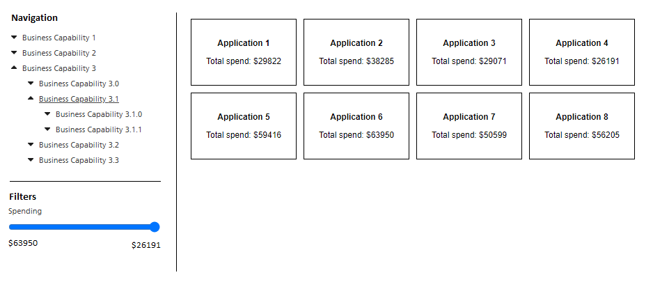

# React Exercise

## Final output DEMO (Prince)

### Thoughts

1. Instructions below mentioned that no external libs are required; but ideally, each item in the navigation tree should link to a different URL which could use a routing library. 
2. The spending filters changes very quickly when dragging and will result in hundreds of re-renders per second. To fix this problem, there are 2 values for the spending filter, one local only to the filter component and the other in the global context. I created a [`useThrottle`](./src/hooks/useThrottle.ts) hook that only updates the global context value every 200ms.

---

## Instructions

This exercise is to help us better understand your experience in react and typescript, how you would go about structuring your work, code quality, styles, etc...

## Setup

To get started, install the dependencies with `npm install`.

Run the application with `npm start`.

Launch application in browser at [http://localhost:3000](http://localhost:3000).

## Task

We would like you to build a simple data explorer as shown in the image below. This is a wireframe to demonstrate how the app should look once complete. Do not add any additional dependencies and you do not need to amend the data service to complete this task.

The data is a list of application records and is fetchable at `/data`. Each application has 3 levels of business capabilities. Business capabilities are hierarchical as shown in the image (Business capability 1 -> Business capability 2 -> Business capability 3)

The app should -

- Requests the dataset.
- Build a hierarchical navigation tree displaying the different levels of business capabilities. Bonus points if we can expand/collapse the navigation tree.
- Have a range slider to be able to further filter the dataset based on the total spending value
- Present a list of applications from the data set, showing name and total spend. The list depends on the navigation tree and the range filter

Additional notes

- Please spend as much time as you feel necessary to complete the task and show off your skills.
- We will be looking at code/file structure, code quality & best practices & design.
- Add comments where necessary or to document any assumptions/considerations you may have.
- You shouldn't need to use any external libraries
